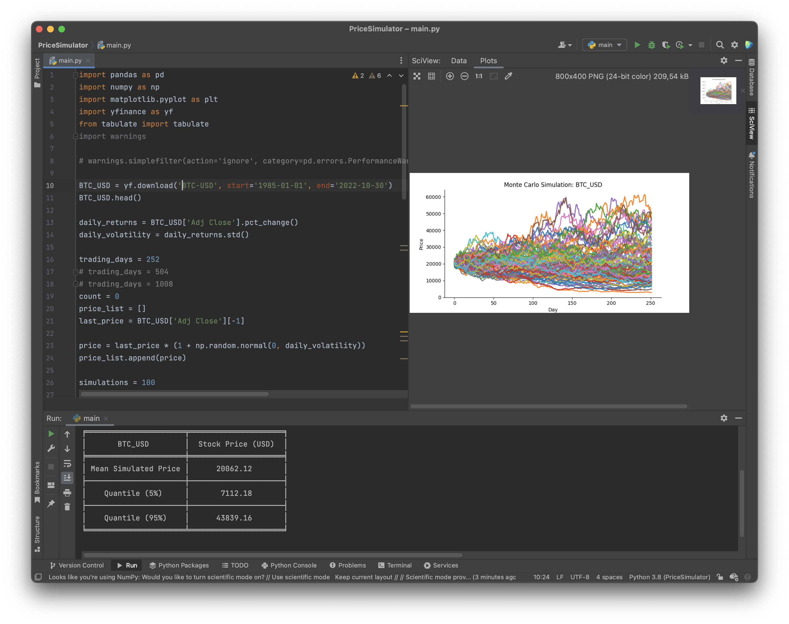
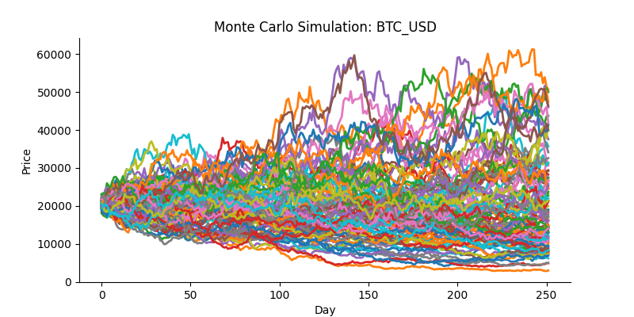

# Monte Carlo Price Simulation

Monte Carlo simulations are powerful tools in many fields, including operations research, game theory, physics, economics, and finance.  
It is a technique for understanding the impact of risk and uncertainty on decision-making. In short, a Monte Carlo simulation performs a large number of experiments with different random numbers generated from an underlying distribution of uncertain variables.
 In this project I've used Monte Carlo to predict the prices of Crypto   

If you like to dive deeper into the how's and why's, I've provided some useful links down below 

## Result
The program will provide a graph with all the simulation (in this example a 100)

    

### Provided data 
The returning data based on the simulations ran.

    

## Prerequisites

- Linux/MacOS
- Python 3.8.5+

## sources 

- https://medium.com/analytics-vidhya/monte-carlo-simulations-for-predicting-stock-prices-python-a64f53585662
- https://www.personal.psu.edu/alm24/students/bingqianMonteCarlo.pdf